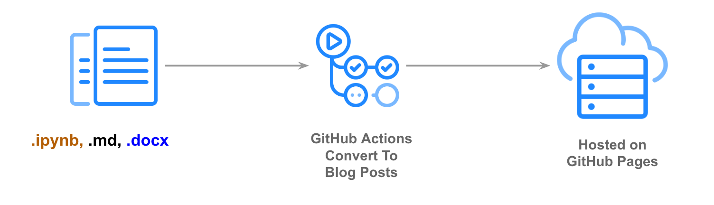

# Miles Ramsey

Intro

I’m a young professional living in downtown Salt Lake City. Currently I work as a Senior Developer at Salesforce Commerce Cloud working on point of sale software. In my free time I enjoy playing dodgeball and kickball, playing retro video games, and most recently collecting vinyl. I always like to have a book to read, and currently it’s Alice’s Adventures in Wonderland by Lewis Carroll. I’m always looking for something new to learn, and am currently pursuing getting a Master’s Degree.

Salesforce -- expand this

Salesforce Commerce Cloud
2015 - Current
Senior Member of Technical Staff, Software Engineering
Developing Point of Sale software
In the top 10 Jira completion rating for developers in the past 2 years
Winner of 2017 Winter Hackathon for building a mobile application that uses AI to identify photos and Buy Online Pick Up In Store
Achieved "Trailhead Ranger" status (only 4% of the company has accomplished this)

Certifit - keep this?

Certifit Auto Body Parts
2012 - 2015
Programmer
Maintain testing suite for product catalog of 30,000 products
Developed Java Point of Sale with scan and verify features
Lead programmer for Selenium tax permit API
Manage accounting data from 30 stores across multiple databases

School - change this?

University of Utah
2009 - 2015
Bachelor of Science in Computer Science
Received Honors at Entrance Scholorship
Scored in the 99th percentile on ACT
Buffer Bomb - disarming a “bomb” reading only compiled assembly code
Created a Netflix clone using relational databases
---

This site is built with [fastpages](https://github.com/fastai/fastpages), An easy to use blogging platform with extra features for Jupyter Notebooks.

[fastpages](https://github.com/fastai/fastpages) automates the process of creating blog posts via GitHub Actions, so you don't have to fuss with conversion scripts.  A full list of features can be found on [GitHub](https://github.com/fastai/fastpages).  

You can edit the `index.md` file to change this content.

# Posts
